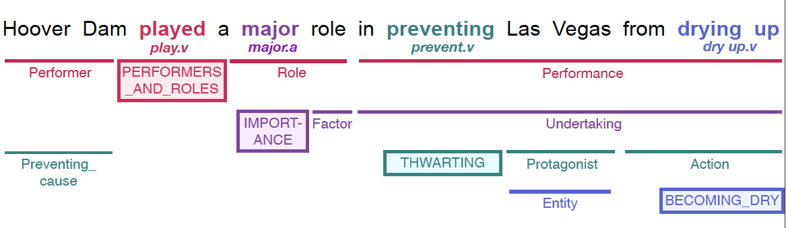

# Open-SESAME

A frame-semantic parser for automatically detecting [FrameNet](https://framenet.icsi.berkeley.edu/fndrupal/) frames and their frame-elements from sentences. The model is based on  softmax-margin segmental recurrent neural nets, described in our paper [Frame-Semantic Parsing with Softmax-Margin Segmental RNNs and a Syntactic Scaffold](https://arxiv.org/abs/1706.09528). An example of a frame-semantic parse is shown below



## Installation

This project is developed using Python 2.7. Other requirements include the [DyNet](http://dynet.readthedocs.io/en/latest/python.html) library, and some [NLTK](https://www.nltk.org/) packages.

```sh
$ pip install dynet
$ pip install nltk
$ python -m nltk.downloader averaged_perceptron_tagger wordnet
```

## Data Preprocessing

This codebase only handles data in the XML format specified under FrameNet. The default version is FrameNet 1.7, but the codebase is backward compatible with versions 1.6 and 1.5.

As a first step the data is preprocessed for ease of readability.

0. Clone the repository.
```sh
$ git clone https://github.com/swabhs/open-sesame.git
$ cd open-sesame/
 ```

1. Create a `data/` directory under the root directory, download [FrameNet version 1.7](https://drive.google.com/open?id=1s4SDt_yDhT8qFs1MZJbeFf-XeiNPNnx7), and extract  under `data/fndata-1.7/`.

2. Second, this project uses pretrained [GloVe word embeddings](https://nlp.stanford.edu/projects/glove/) of 100 dimensions, trained on 6B tokens. [Download](http://nlp.stanford.edu/data/glove.6B.zip) and extract under `data/`.

3. Optionally, make alterations to the configurations in `configurations/global_config.json`, if you have decided to either use a different version of FrameNet, or different pretrained embeddings, etc.

4. In this repository, data is formatted in a [format similar to CoNLL 2009](https://ufal.mff.cuni.cz/conll2009-st/task-description.html), but with BIO tags, for ease of reading, compared to the original XML format. See sample CoNLL formatting [here](https://github.com/swabhs/open-sesame/blob/master/sample.fn1.7.train.conll). Preprocess the data by executing:
```sh
$ python -m sesame.preprocess
```
The above script writes the train, dev and test files in the required format into the `data/neural/fn1.7/` directory. A large fraction of the annotations are either incomplete, or inconsistent. Such annotations are discarded, but logged under `preprocess-fn1.7.log`, along with the respective error messages.


## Training

Frame-semantic parsing involves target identification, frame identification and argument identification --- each step is trained independently of the others. Details can be found in our [paper](https://arxiv.org/abs/1706.09528), and also below.

To train a model, execute:

```sh
$ python -m sesame.$MODEL --mode train --model_name $MODEL_NAME
```

The $MODELs are specified below. Training saves the best model on validation data in the directory `logs/$MODEL_NAME/best-$MODEL-1.7-model`. The same directory will also save a `configurations.json` containing current model configuration.

If training gets interrupted, it can be restarted from the last saved checkpoint by specifying `--mode refresh`.

## Pre-trained Models

The downloads need to be placed under the base-directory. On extraction, these will create a `logs/` directory containing pre-trained models for target identification, frame identification using gold targets, and argument identification using gold targets and frames.

*Note* There is a [known open issue](https://github.com/swabhs/open-sesame/issues/15) about pretrained models not being able to replicate the reported performance on a different machine. It is recommended to train and test from scratch - performance can be replicated (within a small margin of error) to the performance reported below.

|           |  FN 1.5 Dev | FN 1.5 Test | FN 1.5 Models                                                                             |  FN 1.7 Dev | FN 1.7 Test | FN 1.7 Models                                                                             |
|-----------|------------:|------------:|------------------------------------------------------------------------------------------------------|------------:|------------:|------------------------------------------------------------------------------------------------------|
| Target ID |       79.85 |       73.23 | [Download](https://drive.google.com/open?id=1xrBKFOwdqLDim2X3kGysV6B8k1ThXDZh) | 80.26 | 73.25 | [Download](https://drive.google.com/open?id=1sS0OPw1uYxeOUK0drkvfZsFkRNgnVUAC) |
| Frame ID  |       89.27 |       86.40 | [Download](https://drive.google.com/open?id=1Ma1h1x8QDsJFQW047_9KvNLblkxlDdGb) | 89.74 | 86.55 | [Download](https://drive.google.com/open?id=1me1V0CrZF5HVWiDBqZ4LHZVSpsWfW3-8)  |
| Arg ID    |       60.60 |       59.48 | [Download](https://drive.google.com/open?id=1TopWIEvmzQ8MBypo-xrCAokW4bZg1oGz) | 61.21 | 61.36 | [Download](https://drive.google.com/open?id=1ys-DIGhJSHgt8VjstMtlkPnYqtlzMSHe)  |

## Test

The different models for target identification, frame identification and argument identification, *need to be executed in that order*.
To test under a given model, execute:

```sh
$ python -m sesame.$MODEL --mode test --model_name $MODEL_NAME
```

The output, in a CoNLL 2009-like format will be written to `logs/$MODEL_NAME/predicted-1.7-$MODEL-test.conll` and in the [frame-elements file format](https://github.com/Noahs-ARK/semafor/tree/master/training/data) to `logs/$MODEL_NAME/predicted-1.7-$MODEL-test.fes` for frame and argument identification.

### 1. Target Identification

`$MODEL = targetid`

A bidirectional LSTM model takes into account the lexical unit index in FrameNet to identify targets. This model has *not* been described in the [paper](https://arxiv.org/abs/1706.09528).

### 2. Frame Identification

`$MODEL = frameid`

Frame identification is based on a bidirectional LSTM model. Targets and their respective lexical units need to be identified before this step. At test time, example-wise analysis is logged in the model directory.

### 3. Argument (Frame-Element) Identification

`$MODEL = argid`

Argument identification is based on a segmental recurrent neural net, used as the *baseline* in the [paper](https://arxiv.org/abs/1706.09528). Targets and their respective lexical units need to be identified, and frames corresponding to the LUs predicted before this step. At test time, example-wise analysis is logged in the model directory.

## Prediction on unannotated data

For predicting targets, frames and arguments on unannotated data, pretrained models are needed. Input needs to be specified in a file containing one sentence per line. The following steps result in the full frame-semantic parsing of the sentences:

```sh
$ python -m sesame.targetid --mode predict \
                            --model_name fn1.7-pretrained-targetid \
                            --raw_input sentences.txt
$ python -m sesame.frameid --mode predict \
                           --model_name fn1.7-pretrained-frameid \
                           --raw_input logs/fn1.7-pretrained-targetid/predicted-targets.conll
$ python -m sesame.argid --mode predict \
                         --model_name fn1.7-pretrained-argid \
                         --raw_input logs/fn1.7-pretrained-frameid/predicted-frames.conll
```

The resulting frame-semantic parses will be written to `logs/fn1.7-pretrained-argid/predicted-args.conll` in the same CoNLL 2009-like format.

## Contact and Reference

For questions and usage issues, please contact `sswayamd@alumni.cmu.edu`. If you use open-sesame for research, please cite [our paper](https://arxiv.org/pdf/1706.09528.pdf) as follows:

```
@article{swayamdipta:17,
  title={{Frame-Semantic Parsing with Softmax-Margin Segmental RNNs and a Syntactic Scaffold}},
  author={Swabha Swayamdipta and Sam Thomson and Chris Dyer and Noah A. Smith},
  journal={arXiv preprint arXiv:1706.09528},
  year={2017}
}
```
Copyright [2018] [Swabha Swayamdipta]
